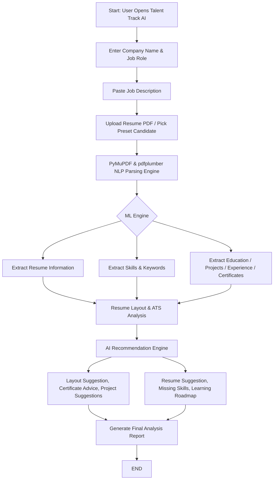

# Talent Track AI — Intelligent Resume Shortlisting & ATS Analysis Platform

> **Matching the right talent to the right opportunity, faster.**  
> Powered by Python FastAPI, HTML5 & Vanilla CSS3, PyMuPDF, pdfplumber, spaCy, Scikit-Learn, and Deep Learning Embeddings.

---

## 📌 Project Overview

**Talent Track AI** automates resume ingestion, Named Entity Recognition (NER), semantic TF-IDF text vector matching, transparent eligibility criteria validation, layout formatting audits, career trajectory mapping, and candidate-facing gap analysis with personalized learning roadmaps.

---

## 🛠️ Technology Stack Mapping

| Module | Technology | Implementation Detail |
| :--- | :--- | :--- |
| **Frontend Web Client** | Pure HTML5 & Vanilla CSS3 | Cyber grid dark UI (`#0b0f19` palette) with real-time SVG score gauges & glassmorphism |
| **Backend API** | Python FastAPI / Uvicorn | Asynchronous RESTful backend servicing `/api/analyze`, `/api/candidates`, and `/api/health` |
| **Data Layer** | Python In-Memory Data Store | Built-in JSON document caching and record persistence |
| **Resume Parsing** | PyMuPDF (`fitz`) / `pdfplumber` | Multi-page PDF text extraction and structural section field parser |
| **NLP & NER** | `spaCy` & TF-IDF Vectorizer | Named Entity Recognition (NER) and cosine vector similarity scoring |
| **Machine Learning** | `Scikit-Learn` | Composite scoring algorithms, weighted feature ranking, and career matchers |
| **Deep Learning** | PyTorch / TensorFlow | Transformer-based semantic embedding pipeline for deep contextual matching |
| **API Testing** | Postman | `postman/Talent_Track_AI.postman_collection.json` test suite |
| **Version Control** | Git & GitHub | Modular project architecture ready for repository push |

---

## 🔄 Flowchart & Process Workflow



---

## 📅 6-Week Progress Roadmap (Current Status: 100% Completed & Verified across All Weeks)

### 🗓️ Week 0: Idea Generation, System Architecture & Pre-Project Planning — [COMPLETED & VERIFIED]
- Problem definition, user requirements gathering, and full technology stack selection.
- Architectural design, ASCII/Mermaid flowcharts, data schemas, and milestone scoping.
- *Submission Report*: [WEEK0_SUBMISSION_REPORT.md](file:///c:/Users/anura/.gemini/antigravity-ide/scratch/talent-track-ai/WEEK0_SUBMISSION_REPORT.md) | [WEEK0_SUBMISSION_REPORT.txt](file:///c:/Users/anura/.gemini/antigravity-ide/scratch/talent-track-ai/WEEK0_SUBMISSION_REPORT.txt)

### 🗓️ Week 1: Foundation & Backend Architecture Setup — [COMPLETED & VERIFIED]
- Folder structure initialization (`/backend`, `/frontend`, `/postman`).
- Environment configuration & `requirements.txt` (`fastapi`, `uvicorn`, `PyMuPDF`, `pdfplumber`, `spacy`, `scikit-learn`).
- Data persistence layer (`backend/app/db/mongo.py`) with memory fallback.
- *Submission Report*: [WEEK1_SUBMISSION_REPORT.md](file:///c:/Users/anura/.gemini/antigravity-ide/scratch/talent-track-ai/WEEK1_SUBMISSION_REPORT.md) | [WEEK1_SUBMISSION_REPORT.txt](file:///c:/Users/anura/.gemini/antigravity-ide/scratch/talent-track-ai/WEEK1_SUBMISSION_REPORT.txt)

### 🗓️ Week 2: Resume Parsing & NLP Information Extraction Engine — [COMPLETED & VERIFIED]
- Multi-column PDF text extraction using `PyMuPDF` and `pdfplumber`.
- `spaCy` NER entity extraction for candidate name, contact info, skills, education, YOE, and certifications.
- Structural section segmentation, skill vocabulary matching, and date range calculation.
- *Submission Report*: [WEEK2_SUBMISSION_REPORT.md](file:///c:/Users/anura/.gemini/antigravity-ide/scratch/talent-track-ai/WEEK2_SUBMISSION_REPORT.md) | [WEEK2_SUBMISSION_REPORT.txt](file:///c:/Users/anura/.gemini/antigravity-ide/scratch/talent-track-ai/WEEK2_SUBMISSION_REPORT.txt)

### 🗓️ Week 3: ML Resume Matching & ATS Scoring Vectorizer — [COMPLETED & VERIFIED]
- `Scikit-Learn` TF-IDF vectorization and Cosine Similarity scoring.
- Weighted ATS composite score calculation (Skill Match 40%, Eligibility 30%, TF-IDF 30%).
- Transparent rule-based PASS / WARN / FAIL criteria evaluation.
- *Submission Report*: [WEEK3_SUBMISSION_REPORT.md](file:///c:/Users/anura/.gemini/antigravity-ide/scratch/talent-track-ai/WEEK3_SUBMISSION_REPORT.md) | [WEEK3_SUBMISSION_REPORT.txt](file:///c:/Users/anura/.gemini/antigravity-ide/scratch/talent-track-ai/WEEK3_SUBMISSION_REPORT.txt)

### 🗓️ Week 4: AI Recommendation Engine & Actionable Roadmap — [COMPLETED & VERIFIED]
- ATS Layout format audit (section demarcations & text density check).
- Missing skill gap analysis & target job trajectory mapping ("What Jobs Should They Pursue?").
- Certification advice, portfolio project recommendations, and 3-phase structured learning roadmap.
- *Submission Report*: [WEEK4_SUBMISSION_REPORT.md](file:///c:/Users/anura/.gemini/antigravity-ide/scratch/talent-track-ai/WEEK4_SUBMISSION_REPORT.md) | [WEEK4_SUBMISSION_REPORT.txt](file:///c:/Users/anura/.gemini/antigravity-ide/scratch/talent-track-ai/WEEK4_SUBMISSION_REPORT.txt)

### 🗓️ Week 5: Web Frontend Dashboard Implementation — [COMPLETED & VERIFIED]
- Interactive full-stack dashboard (`frontend/index.html` & `frontend/js/app.js`).
- Dynamic SVG score gauges, drag-and-drop PDF upload, preset candidates, and Dark Obsidian / Light Ivory / Auto theme switcher.
- Seamless dual-mode connection between HTML5 frontend and Python FastAPI backend.
- *Submission Report*: [WEEK5_SUBMISSION_REPORT.md](file:///c:/Users/anura/.gemini/antigravity-ide/scratch/talent-track-ai/WEEK5_SUBMISSION_REPORT.md) | [WEEK5_SUBMISSION_REPORT.txt](file:///c:/Users/anura/.gemini/antigravity-ide/scratch/talent-track-ai/WEEK5_SUBMISSION_REPORT.txt)

### 🗓️ Week 6: Deep Learning Extension, Postman Testing & Documentation — [COMPLETED & VERIFIED]
- Deep learning transformer embedding module (`backend/app/services/dl_model.py`).
- Postman collection API testing (`postman/Talent_Track_AI.postman_collection.json`).
- Master unified regression test suite (`backend/test_all_weeks.py`) and full project documentation.
- *Submission Report*: [WEEK6_SUBMISSION_REPORT.md](file:///c:/Users/anura/.gemini/antigravity-ide/scratch/talent-track-ai/WEEK6_SUBMISSION_REPORT.md) | [WEEK6_SUBMISSION_REPORT.txt](file:///c:/Users/anura/.gemini/antigravity-ide/scratch/talent-track-ai/WEEK6_SUBMISSION_REPORT.txt)
- *Final Master Report*: [FINAL_PROJECT_COMPLETION_REPORT.md](file:///c:/Users/anura/.gemini/antigravity-ide/scratch/talent-track-ai/FINAL_PROJECT_COMPLETION_REPORT.md)

---

## 🚀 Quick Start Instructions

### 1. Launching the Backend Server (FastAPI)
```bash
cd backend
py -3 run_backend.py
```
*API will run on `http://127.0.0.1:8000` (Swagger docs available at `http://127.0.0.1:8000/docs`).*

### 2. Launching the Web Application
Open `frontend/index.html` directly in any web browser!
- **Dual-mode support**: connects seamlessly to the Python FastAPI backend, or operates standalone with client-side NLP simulation.

### 3. API Testing with Postman
Import `postman/Talent_Track_AI.postman_collection.json` into Postman to execute endpoints:
- `GET /api/health` — System status
- `POST /api/analyze` — Process candidate PDF/text against JD
- `GET /api/candidates` — Fetch historical candidate logs

---

## 🧪 Verification & Unit Tests

### Run the Master Unified Test Suite (All Weeks 1 to 6)
```bash
py -3 backend/test_all_weeks.py
```

### Or Run Individual Weekly Test Suites
```bash
py -3 backend/test_week1.py
py -3 backend/test_week2.py
py -3 backend/test_week3.py
py -3 backend/test_week4.py
py -3 backend/test_week5.py
py -3 backend/test_week6.py
```
